# Architecture & Core Concepts

> **Understand how AuthThingie 2 works under the hood**

[🏠 Home](../README.md) • [📖 Getting Started](getting-started.md) • [⚙️ Configuration](configuration.md)

---

## 📋 Table of Contents

- [Core Concepts](#core-concepts)
- [How Forward Authentication Works](#how-forward-authentication-works)
- [Request Flow Diagrams](#request-flow-diagrams)
- [Component Overview](#component-overview)
- [Authentication Methods](#authentication-methods)
- [Session Management](#session-management)
- [Security Model](#security-model)

---

## Core Concepts

### What is Forward Authentication?

**Forward Authentication** is a pattern where a reverse proxy (like Traefik) checks with an authentication service *before* allowing requests through to your applications.

```mermaid
sequenceDiagram
    participant User
    participant Proxy as Reverse Proxy<br/>(Traefik)
    participant Auth as AuthThingie 2
    participant App as Your Service<br/>(Sonarr, etc.)

    User->>Proxy: Request service
    Proxy->>Auth: Check authentication

    alt User authenticated
        Auth-->>Proxy: ✅ OK
        Proxy->>App: Forward request
        App-->>Proxy: Response
        Proxy-->>User: Response
    else User not authenticated
        Auth-->>Proxy: ❌ Not authorized
        Proxy-->>User: Redirect to login
    end
```



**Benefits:**
- ✅ **Centralized auth** - One login for all services
- ✅ **No app changes** - Protect any web service without modifying it
- ✅ **Consistent security** - Same auth rules everywhere
- ✅ **Easy management** - Add/remove users in one place

---

### Why Use a Reverse Proxy?

A **reverse proxy** sits between the internet and your services, managing routing, TLS, and security.

**Without a reverse proxy:**
```
Internet → Service 1 on port 8001
Internet → Service 2 on port 8002
Internet → Service 3 on port 8003
```
*Each service needs its own port, certificate, and authentication*

**With a reverse proxy:**
```
Internet → Reverse Proxy (ports 80/443)
           ├─→ service1.example.com → Service 1
           ├─→ service2.example.com → Service 2
           └─→ service3.example.com → Service 3
```
*One entry point, domain-based routing, shared authentication*

---

## How Forward Authentication Works

### The Authentication Handshake

When a user tries to access a protected service:


### Key Endpoints

AuthThingie 2 exposes several endpoints:

| Endpoint | Purpose | Called By |
|----------|---------|-----------|
| `/forward` | Authentication check | Reverse proxy (Traefik) |
| `/login` | Login page | User's browser |
| `/logout` | End session | User's browser |
| `/setup` | First-time configuration | Admin (one-time) |
| `/api/*` | User management API | Web UI |

---

## Request Flow Diagrams

### First Request (Not Authenticated)


---

### Subsequent Requests (Authenticated)

```mermaid
sequenceDiagram
    autonumber
    participant Browser
    participant Traefik
    participant AuthThingie
    participant Radarr

    Browser->>Traefik: GET radarr.example.com<br/>Cookie: session_token
    Traefik->>AuthThingie: GET /forward<br/>Cookie: session_token
    Note over AuthThingie: Session valid ✓<br/>Rules allow access ✓
    AuthThingie-->>Traefik: 200 OK<br/>X-Forwarded-User: alice
    Traefik->>Radarr: GET /<br/>X-Forwarded-User: alice
    Radarr-->>Browser: Radarr dashboard

    Note over Browser,Radarr: Fast path - no login page!
```



**Key point:** Once authenticated, the check is very fast (just cookie validation + rule matching).

---

## Component Overview

### Architecture Diagram


### Components Explained

#### 1. HTTP Server
- Listens on port 9000 (configurable)
- Handles `/forward`, `/login`, `/logout`, web UI
- Serves static assets (CSS, JS)

#### 2. Authentication Logic
- Validates credentials (password, passkey, TOTP)
- Creates and validates sessions
- Enforces login attempt limits

#### 3. Rule Engine
- Evaluates access rules from config file
- Matches host patterns, path patterns, source IPs
- Checks user permissions and roles

#### 4. Session Store
- In-memory cache of active sessions
- TTL-based expiration
- Backed by secure cookies

#### 5. SQLite Database
- Stores users, roles, passkeys, TOTP secrets
- Tracks login attempts and lockouts
- Persists configuration

---

## Authentication Methods

AuthThingie 2 supports three authentication methods (can be combined):

### 1. Password Authentication

**How it works:**
1. User enters username + password
2. Password hashed with Argon2id
3. Compared against stored hash in database

**Security features:**
- Argon2id hashing (memory-hard, GPU-resistant)
- Configurable minimum length
- Rate limiting per user
- Account lockout after failed attempts

**Best for:** Basic security, required as fallback for passkeys

---

### 2. Passkeys (WebAuthn)

**How it works:**
1. User registers a passkey (Face ID, Touch ID, security key)
2. Public key stored in database
3. Login uses cryptographic challenge-response
4. Private key never leaves user's device


**Security features:**
- Phishing-resistant (domain-bound)
- No password to steal
- Biometric confirmation
- Requires HTTPS

**Best for:** Highest security with best user experience

**Requirements:**
- Valid TLS certificate (Let's Encrypt works)
- Modern browser
- Biometric device or security key

---

### 3. TOTP (Time-Based One-Time Password)

**How it works:**
1. User scans QR code with authenticator app
2. Shared secret stored in database
3. Login requires 6-digit code from app
4. Codes rotate every 30 seconds

**Security features:**
- Second factor (used with passwords)
- Offline code generation
- Time-based expiration
- Configurable time window tolerance

**Best for:** Two-factor authentication without special hardware

**Compatible apps:**
- Google Authenticator
- Authy
- 1Password
- Bitwarden
- Microsoft Authenticator

---

## Session Management

### How Sessions Work

When you log in, AuthThingie creates a session:


**Cookie properties:**
- `HttpOnly` - Not accessible to JavaScript (XSS protection)
- `Secure` - Only sent over HTTPS
- `SameSite=Lax` - CSRF protection
- `Domain=.example.com` - Works across subdomains
- Cryptographically signed (tamper-proof)

### Session Lifecycle


### Session Storage

Sessions are stored **in-memory only** (not in database):

**Advantages:**
- ⚡ Fast validation
- 🔒 Automatic cleanup on restart
- 📦 No disk writes

**Implications:**
- Restarting AuthThingie logs everyone out
- Sessions don't survive container recreation
- Can't share sessions across multiple AuthThingie instances

**Pro tip:** Use long session timeouts (7 days) for home labs to minimize re-logins.

---

## Security Model

### Defense in Depth


### Security Features

| Layer | Protection | Implementation |
|-------|-----------|----------------|
| **Transport** | Encryption | TLS 1.2+, HTTPS required for passkeys |
| **Authentication** | Identity verification | Argon2id passwords, WebAuthn passkeys, TOTP |
| **Rate Limiting** | Brute force prevention | Max login attempts, account lockout |
| **Authorization** | Access control | Rule-based permissions, roles |
| **Session Security** | Token safety | Signed cookies, HttpOnly, SameSite |
| **Input Validation** | Injection prevention | Parameterized SQL, XSS escaping |

### Trust Boundaries

```mermaid
graph TB
    subgraph "Untrusted Zone"
        Internet[🌐 Internet]
    end

    subgraph "DMZ"
        Proxy[Reverse Proxy<br/>TLS Termination]
    end

    subgraph "Trusted Zone - Docker"
        Auth[AuthThingie<br/>Authentication]
        Services[Your Services<br/>No internet exposure]
    end

    Internet -->|HTTPS Only| Proxy
    Proxy -->|HTTP/HTTPS| Auth
    Proxy -->|HTTP| Services
    Auth -.->|Validation| Proxy

    style Internet fill:#f44336
    style Proxy fill:#FF9800
    style Auth fill:#4CAF50
    style Services fill:#2196F3
```



**Key points:**
1. **Only reverse proxy exposed** - Services never directly accessible
2. **TLS termination at proxy** - Internal traffic can be HTTP
3. **AuthThingie validates all requests** - Zero trust model
4. **Services trust proxy headers** - X-Forwarded-User is authoritative

---

### Attack Mitigations

| Attack Type | How AuthThingie Protects |
|-------------|-------------------------|
| **Brute Force** | Rate limiting, account lockout, exponential backoff |
| **Credential Stuffing** | Unique sessions per user, no password reuse detection (yet) |
| **Session Hijacking** | Signed cookies, HttpOnly flag, short-lived sessions |
| **CSRF** | SameSite cookies, state tokens in forms |
| **XSS** | Content-Security-Policy headers, escaped output |
| **Man-in-the-Middle** | HTTPS required (especially for passkeys) |
| **Phishing** | Passkeys domain-bound (can't be phished) |
| **SQL Injection** | Parameterized queries throughout |

---

## 🔗 Related Documentation

- **[Configuration Reference](configuration.md)** - Configure security settings
- **[Getting Started](getting-started.md)** - Set up your first instance
- **[Troubleshooting](troubleshooting.md)** - Debug authentication issues
- **[Advanced Scenarios](advanced.md)** - Complex setups

---

[🏠 Back to Home](../README.md)
