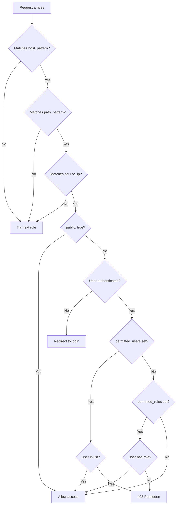

# Configuration Reference

> **Complete guide to AuthThingie 2 configuration options**

[🏠 Home](../README.md) • [📖 Getting Started](getting-started.md) • [🏗️ Architecture](architecture.md)

---

## 📋 Table of Contents

- [Configuration File Location](#configuration-file-location)
- [Configuration File Structure](#configuration-file-structure)
- [Server Section](#server-section)
- [Database Section](#database-section)
- [Access Rules](#access-rules)
- [Session Configuration](#session-configuration)
- [Security Options](#security-options)
- [Advanced Options](#advanced-options)
- [Environment Variables](#environment-variables)
- [Examples](#examples)

---

## Configuration File Location

AuthThingie 2 looks for its configuration file at:

```
/config/auththingie2.yaml
```

When running in Docker, mount your config directory to `/config`:

```yaml
volumes:
  - ./my-config-folder:/config
```

The configuration file is **optional on first run**—the setup wizard will create it for you.

---

## Configuration File Structure

A complete configuration file looks like this:

```yaml
server:
  port: 9000
  domain: example.com
  auth_url: https://auth.example.com
  session_timeout: 24h

db:
  kind: sqlite
  file: /config/at2.db

rules:
  - name: Public CSS files
    host_pattern: "*.example.com"
    path_pattern: "/css/*"
    public: true

  - name: Admin panel
    host_pattern: "admin.example.com"
    path_pattern: "*"
    permitted_roles:
      - admin

  - name: Local network access
    host_pattern: "internal.example.com"
    source_ip: "192.168.1.0/24"

security:
  password_min_length: 12
  max_login_attempts: 5
  lockout_duration: 15m
  totp_window: 1
```

---

## Server Section

Controls how AuthThingie runs and handles requests.

### `port`
- **Type:** Integer
- **Default:** `9000`
- **Description:** Port the HTTP server listens on

```yaml
server:
  port: 9000
```

> **Note:** This should match the Traefik label `traefik.http.services.auth.loadbalancer.server.port`

---

### `domain`
- **Type:** String
- **Required:** Yes
- **Description:** Root domain for cookie scope

```yaml
server:
  domain: example.com
```

**Important:**
- Use the **root domain** (e.g., `example.com`), not subdomains
- This allows the session cookie to work across all subdomains
- If protecting `app1.example.com` and `app2.example.com`, use `example.com`

---

### `auth_url`
- **Type:** String (URL)
- **Required:** Yes
- **Description:** Full URL where AuthThingie is accessible

```yaml
server:
  auth_url: https://auth.example.com
```

**Used for:**
- Redirecting users to the login page
- Generating passkey/TOTP QR codes
- OAuth-style flows

---

### `session_timeout`
- **Type:** Duration
- **Default:** `24h`
- **Description:** How long sessions last before re-authentication required

```yaml
server:
  session_timeout: 12h  # 12 hours
```

**Duration format:**
- `30s` = 30 seconds
- `15m` = 15 minutes
- `24h` = 24 hours
- `7d` = 7 days

---

### `behind_proxy`
- **Type:** Boolean
- **Default:** `true`
- **Description:** Whether running behind a reverse proxy (Traefik, Nginx, etc.)

```yaml
server:
  behind_proxy: true
```

**Effect:**
- When `true`, trusts `X-Forwarded-For` and `X-Real-IP` headers
- When `false`, uses direct connection IP (only use if directly exposed)

---

## Database Section

Configures where user data is stored.

### `kind`
- **Type:** String
- **Default:** `sqlite`
- **Description:** Database type (currently only SQLite supported)

```yaml
db:
  kind: sqlite
```

---

### `file`
- **Type:** String (path)
- **Required:** Yes (for SQLite)
- **Description:** Path to SQLite database file

```yaml
db:
  file: /config/at2.db
```

**Notes:**
- File is auto-created if it doesn't exist
- Ensure the directory is writable
- Back this up regularly—it contains all users and settings!

---

## Access Rules

Rules control who can access what. **Rules are evaluated in order** until a match is found.

### Rule Structure

```yaml
rules:
  - name: "Descriptive name"
    host_pattern: "service.example.com"
    path_pattern: "/admin/*"
    source_ip: "192.168.1.0/24"
    public: false
    permitted_users:
      - alice
      - bob
    permitted_roles:
      - admin
```

### Rule Fields

| Field | Type | Description |
|-------|------|-------------|
| `name` | String | Human-readable rule description |
| `host_pattern` | String | Domain pattern to match (supports wildcards) |
| `path_pattern` | String | URL path pattern (supports wildcards) |
| `source_ip` | String | CIDR range for IP-based access |
| `public` | Boolean | If `true`, no authentication required |
| `permitted_users` | List | Usernames allowed to access |
| `permitted_roles` | List | Roles allowed to access |

---

### Pattern Matching

**Wildcard support:**
- `*` matches anything
- `?` matches single character

**Examples:**

| Pattern | Matches | Doesn't Match |
|---------|---------|---------------|
| `example.com` | `example.com` | `sub.example.com` |
| `*.example.com` | `app.example.com`, `api.example.com` | `example.com` |
| `/api/*` | `/api/v1`, `/api/users` | `/app/api` |
| `/admin*` | `/admin`, `/admin/users` | `/api/admin` |

---

### Rule Evaluation Logic



**Key points:**
1. All specified patterns must match (AND logic)
2. First matching rule wins
3. If no rules match, **default deny** (authentication required)
4. If `permitted_users` or `permitted_roles` set, user must match one

---

### Rule Examples

#### 1. Public Access (No Login)

```yaml
rules:
  - name: Public blog
    host_pattern: "blog.example.com"
    path_pattern: "*"
    public: true
```

**Use case:** Allow anyone to access your blog without logging in.

---

#### 2. Restrict by User

```yaml
rules:
  - name: Finance app - CFO only
    host_pattern: "finance.example.com"
    permitted_users:
      - alice
      - bob
```

**Use case:** Only specific users can access the finance application.

---

#### 3. Restrict by Role

```yaml
rules:
  - name: Admin panel
    host_pattern: "admin.example.com"
    permitted_roles:
      - admin
      - superuser
```

**Use case:** Only users with "admin" or "superuser" role can access admin panel.

---

#### 4. IP-Based Access

```yaml
rules:
  - name: Internal network only
    host_pattern: "internal.example.com"
    source_ip: "192.168.1.0/24"
```

**Use case:** Service only accessible from local network (no VPN authentication needed).

---

#### 5. Combined Restrictions

```yaml
rules:
  - name: Staging environment - devs from office
    host_pattern: "staging.example.com"
    source_ip: "203.0.113.0/24"  # Office IP range
    permitted_roles:
      - developer
```

**Use case:** Staging server accessible only from office network by developers.

---

#### 6. Path-Based Access

```yaml
rules:
  - name: Public API docs
    host_pattern: "api.example.com"
    path_pattern: "/docs*"
    public: true

  - name: API endpoints
    host_pattern: "api.example.com"
    path_pattern: "/v1/*"
    permitted_roles:
      - api_user
```

**Use case:** API documentation is public, but API itself requires authentication.

---

#### 7. Wildcard Subdomain

```yaml
rules:
  - name: All user subdomains
    host_pattern: "*.users.example.com"
    permitted_roles:
      - customer
```

**Use case:** Multi-tenant app where each customer gets a subdomain.

---

### Rule Order Matters!

**Wrong order (more specific rule never matches):**

```yaml
rules:
  - name: All services require auth
    host_pattern: "*.example.com"

  - name: Public homepage
    host_pattern: "www.example.com"
    public: true  # This will NEVER match!
```

**Correct order (specific rules first):**

```yaml
rules:
  - name: Public homepage
    host_pattern: "www.example.com"
    public: true

  - name: All other services require auth
    host_pattern: "*.example.com"
```

---

## Session Configuration

### `session_timeout`
See [Server Section](#session_timeout) above.

### `cookie_name`
- **Type:** String
- **Default:** `auththingie_session`
- **Description:** Name of the session cookie

```yaml
server:
  cookie_name: my_custom_session
```

> **Note:** Change this if you run multiple AuthThingie instances on different ports.

---

## Security Options

### `password_min_length`
- **Type:** Integer
- **Default:** `8`
- **Description:** Minimum password length for new users

```yaml
security:
  password_min_length: 12
```

---

### `max_login_attempts`
- **Type:** Integer
- **Default:** `5`
- **Description:** Failed login attempts before account lockout

```yaml
security:
  max_login_attempts: 3
```

---

### `lockout_duration`
- **Type:** Duration
- **Default:** `15m`
- **Description:** How long accounts are locked after too many failures

```yaml
security:
  lockout_duration: 30m
```

---

### `totp_window`
- **Type:** Integer
- **Default:** `1`
- **Description:** TOTP time-step tolerance (1 = ±30 seconds)

```yaml
security:
  totp_window: 2  # ±60 seconds
```

**Use cases:**
- `1` (default) = strict, 30-second window
- `2` = relaxed, 60-second window (helps with clock drift)

---

## Advanced Options

### `log_level`
- **Type:** String
- **Default:** `info`
- **Options:** `debug`, `info`, `warn`, `error`

```yaml
server:
  log_level: debug
```

**When to use:**
- `debug` - Troubleshooting issues, verbose logging
- `info` - Normal operation (default)
- `warn` - Only warnings and errors
- `error` - Only errors

---

### `true_ip_header`
- **Type:** String
- **Default:** `X-Forwarded-For`
- **Description:** Header to use for client IP detection

```yaml
server:
  true_ip_header: CF-Connecting-IP  # For Cloudflare
```

**Common values:**
- `X-Forwarded-For` - Standard, used by most proxies
- `X-Real-IP` - Nginx-specific
- `CF-Connecting-IP` - Cloudflare
- `True-Client-IP` - Akamai

---

### `metrics_enabled`
- **Type:** Boolean
- **Default:** `false`
- **Description:** Enable Prometheus metrics endpoint

```yaml
server:
  metrics_enabled: true
```

When enabled, metrics available at `http://auth:9000/metrics`

---

## Environment Variables

Some settings can be overridden with environment variables:

| Variable | Description | Example |
|----------|-------------|---------|
| `AT2_CONFIG_PATH` | Config file location | `/custom/path/config.yaml` |
| `AT2_PORT` | Override port | `8080` |
| `AT2_LOG_LEVEL` | Override log level | `debug` |
| `TZ` | Container timezone | `America/New_York` |
| `PUID` / `PGID` | User/group ID for file permissions | `1000` / `1000` |

**Example in Docker Compose:**

```yaml
environment:
  - AT2_LOG_LEVEL=debug
  - TZ=Europe/London
  - PUID=1000
  - PGID=1000
```

---

## Examples

### Minimal Configuration

```yaml
server:
  domain: example.com
  auth_url: https://auth.example.com

db:
  kind: sqlite
  file: /config/at2.db
```

This is the bare minimum. All services require authentication, no special rules.

---

### Home Lab Setup

```yaml
server:
  port: 9000
  domain: home.local
  auth_url: https://auth.home.local
  session_timeout: 7d  # Stay logged in for a week

db:
  kind: sqlite
  file: /config/at2.db

rules:
  - name: Local network auto-login
    source_ip: "192.168.1.0/24"
    # No authentication needed from home network

security:
  password_min_length: 10
  max_login_attempts: 10  # Relaxed for family members
```

---

### Multi-Tenant SaaS

```yaml
server:
  domain: saas.example.com
  auth_url: https://auth.saas.example.com
  session_timeout: 8h  # Re-auth after work day

db:
  kind: sqlite
  file: /config/at2.db

rules:
  - name: Marketing site public
    host_pattern: "www.saas.example.com"
    public: true

  - name: Customer portals
    host_pattern: "*.saas.example.com"
    permitted_roles:
      - customer

  - name: Admin panel
    host_pattern: "admin.saas.example.com"
    permitted_roles:
      - admin

security:
  password_min_length: 14
  max_login_attempts: 3
  lockout_duration: 1h
```

---

### Development Environment

```yaml
server:
  port: 9000
  domain: dev.localhost
  auth_url: http://auth.dev.localhost:9000
  log_level: debug
  session_timeout: 24h

db:
  kind: sqlite
  file: /config/at2.db

rules:
  - name: Everything public for testing
    host_pattern: "*"
    public: true

security:
  password_min_length: 4  # Easy passwords for dev
  max_login_attempts: 999  # Never lock out
```

---

## 🔗 Related Documentation

- **[Getting Started](getting-started.md)** - Set up your first configuration
- **[Architecture](architecture.md)** - Understand how rules are processed
- **[Advanced Scenarios](advanced.md)** - Complex multi-domain setups
- **[Troubleshooting](troubleshooting.md)** - Fix configuration issues

---

[🏠 Back to Home](../README.md)
