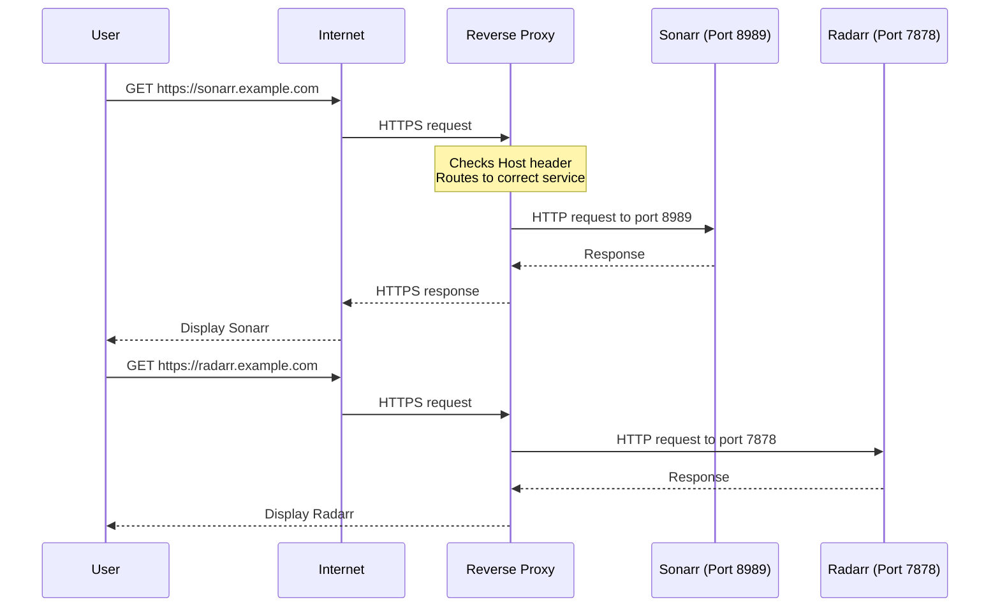
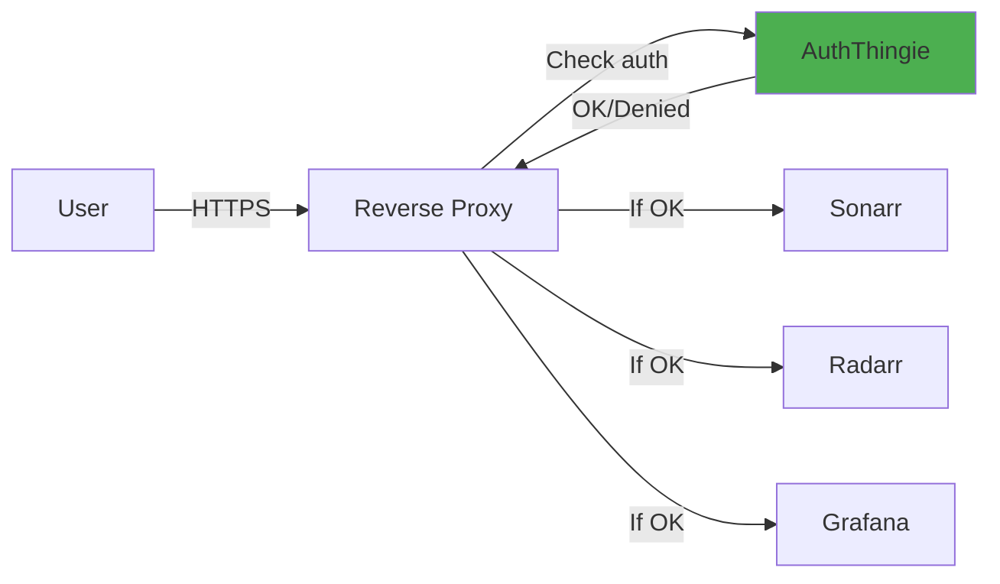
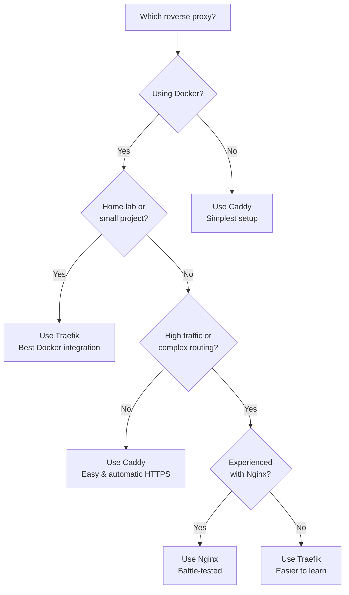

# Reverse Proxy Primer

> **A gentle introduction to reverse proxies and why you need one**

[🏠 Home](../README.md) • [📖 Getting Started](getting-started.md) • [🏗️ Architecture](architecture.md)

---

## 📋 Table of Contents

- [What is a Reverse Proxy?](#what-is-a-reverse-proxy)
- [Why Use a Reverse Proxy?](#why-use-a-reverse-proxy)
- [Popular Reverse Proxy Solutions](#popular-reverse-proxy-solutions)
- [Choosing the Right Proxy](#choosing-the-right-proxy)
- [Setting Up Traefik](#setting-up-traefik)
- [Setting Up Nginx](#setting-up-nginx)
- [Setting Up Caddy](#setting-up-caddy)
- [Integration with AuthThingie](#integration-with-auththingie)

---

## What is a Reverse Proxy?

A **reverse proxy** sits between the internet and your web services, acting as a smart traffic director.

### Visual Explanation

**Without a reverse proxy:**
```
Internet → Your Server
              ├─ Port 8001 → Service A (Sonarr)
              ├─ Port 8002 → Service B (Radarr)
              ├─ Port 8003 → Service C (Grafana)
              └─ Port 8004 → Service D (AuthThingie)
```

**Problems:**
- 😞 Remember different ports for each service
- 😞 Configure TLS/HTTPS separately for each
- 😞 Expose many ports to the internet
- 😞 No centralized authentication or security

---

**With a reverse proxy:**
```
Internet → Reverse Proxy (Port 443 HTTPS)
              ├─ sonarr.example.com    → Service A (Port 8001)
              ├─ radarr.example.com    → Service B (Port 8002)
              ├─ grafana.example.com   → Service C (Port 8003)
              └─ auth.example.com      → Service D (Port 8004)
```

**Benefits:**
- ✅ One entry point (port 443)
- ✅ Nice domain names instead of ports
- ✅ Single TLS certificate or automatic Let's Encrypt
- ✅ Centralized authentication (via AuthThingie!)
- ✅ Load balancing, caching, security headers

---

### How It Works



**Key concept:** The reverse proxy looks at the **domain name** (Host header) and routes the request to the appropriate service.

---

## Why Use a Reverse Proxy?

### 1. Domain-Based Routing

**Before:** `http://192.168.1.100:8989` (hard to remember)
**After:** `https://sonarr.example.com` (easy and professional)

---

### 2. HTTPS/TLS Termination

The proxy handles encryption, so your services don't have to.

**Benefits:**
- One certificate for all services
- Automatic renewal with Let's Encrypt
- Modern TLS settings (TLS 1.3, strong ciphers)

**Example:** Services run plain HTTP internally (fast), proxy adds HTTPS at the edge (secure).

---

### 3. Centralized Authentication

With AuthThingie 2 and forward authentication:
- ✅ One login protects all services
- ✅ No per-service configuration
- ✅ Consistent security policy



---

### 4. Additional Security Features

- **Rate limiting:** Prevent brute force attacks
- **IP filtering:** Restrict access by location
- **Security headers:** XSS protection, CSP, HSTS
- **DDoS protection:** Block malicious traffic
- **Hide internal topology:** Services never directly exposed

---

### 5. Load Balancing & High Availability

**Run multiple instances:**
```
Reverse Proxy → Instance 1 (active)
             └→ Instance 2 (backup)
```

If one fails, traffic automatically routes to the other.

---

### 6. Simplified Management

**One place to configure:**
- TLS certificates
- Domain routing
- Security policies
- Access control
- Logging

**Instead of:** Configuring each service individually.

---

## Popular Reverse Proxy Solutions

### Comparison Table

| Feature | Traefik | Nginx | Caddy | HAProxy |
|---------|---------|-------|-------|---------|
| **Ease of Setup** | ⭐⭐⭐⭐⭐ | ⭐⭐⭐ | ⭐⭐⭐⭐⭐ | ⭐⭐ |
| **Docker Integration** | ⭐⭐⭐⭐⭐ | ⭐⭐⭐ | ⭐⭐⭐ | ⭐⭐ |
| **Auto TLS** | ✅ Let's Encrypt | ❌ (manual) | ✅ Automatic | ❌ |
| **Config Style** | Labels/YAML | Text files | Caddyfile | Text files |
| **Performance** | ⭐⭐⭐⭐ | ⭐⭐⭐⭐⭐ | ⭐⭐⭐⭐ | ⭐⭐⭐⭐⭐ |
| **Learning Curve** | Low | Medium | Low | High |
| **Best For** | Docker, home labs | Production, high scale | Quick setup | TCP load balancing |
| **Forward Auth** | ✅ Built-in | ✅ auth_request | ✅ Plugin | ⚠️ Complex |

---

### Traefik

**Best for:** Docker environments, home labs, quick setup
**Website:** [traefik.io](https://traefik.io/)

**Why choose Traefik:**
- ✅ Automatically discovers Docker containers (no config files!)
- ✅ Built-in Let's Encrypt support
- ✅ Native forward authentication
- ✅ Dynamic configuration via labels
- ✅ Beautiful dashboard
- ✅ **Easiest integration with AuthThingie 2**

**Example Docker Compose label:**
```yaml
labels:
  - "traefik.http.routers.myapp.rule=Host(`myapp.example.com`)"
```
That's it! Traefik automatically picks it up.

**Resources:**
- [Official documentation](https://doc.traefik.io/traefik/)
- [Quick start guide](https://doc.traefik.io/traefik/getting-started/quick-start/)
- [Docker provider guide](https://doc.traefik.io/traefik/providers/docker/)

---

### Nginx

**Best for:** Production environments, high traffic, advanced configs
**Website:** [nginx.org](https://nginx.org/)

**Why choose Nginx:**
- ✅ Industry standard (35% of top sites use it)
- ✅ Extremely fast and efficient
- ✅ Battle-tested for decades
- ✅ Powerful configuration language
- ❌ Manual configuration (no auto-discovery)
- ❌ Requires separate tool for Let's Encrypt (certbot)

**Example config:**
```nginx
server {
    listen 443 ssl;
    server_name myapp.example.com;

    ssl_certificate /etc/ssl/certs/myapp.crt;
    ssl_certificate_key /etc/ssl/private/myapp.key;

    location / {
        proxy_pass http://myapp:8080;
    }
}
```

**Resources:**
- [Official documentation](https://nginx.org/en/docs/)
- [Nginx Proxy Manager](https://nginxproxymanager.com/) (GUI for easier management)
- [Certbot for Let's Encrypt](https://certbot.eff.org/)

---

### Caddy

**Best for:** Simplicity, automatic HTTPS, small deployments
**Website:** [caddyserver.com](https://caddyserver.com/)

**Why choose Caddy:**
- ✅ **Automatic HTTPS by default** (easiest TLS setup)
- ✅ Dead simple configuration (Caddyfile)
- ✅ Modern and clean codebase
- ✅ Good performance
- ⚠️ Forward auth requires plugin
- ⚠️ Smaller community than Nginx/Traefik

**Example Caddyfile:**
```caddy
myapp.example.com {
    reverse_proxy myapp:8080
}
```
That's it! HTTPS is automatic.

**Resources:**
- [Official documentation](https://caddyserver.com/docs/)
- [Getting started](https://caddyserver.com/docs/getting-started)
- [Reverse proxy guide](https://caddyserver.com/docs/quick-starts/reverse-proxy)

---

### HAProxy

**Best for:** TCP load balancing, high performance requirements
**Website:** [haproxy.org](https://www.haproxy.org/)

**Why choose HAProxy:**
- ✅ Extremely fast (often fastest of all)
- ✅ Powerful load balancing features
- ✅ Works at TCP layer (not just HTTP)
- ❌ Complex configuration
- ❌ No automatic TLS/Let's Encrypt
- ❌ Forward auth requires Lua scripting

**Verdict:** Great for large-scale deployments, overkill for home labs.

**Resources:**
- [Official documentation](https://docs.haproxy.org/)
- [Configuration manual](https://www.haproxy.com/documentation/hapee/latest/configuration/)

---

## Choosing the Right Proxy

### Decision Tree



---

### Quick Recommendations

**You should use Traefik if:**
- ✅ Running Docker Compose
- ✅ Want automatic service discovery
- ✅ Need easy Let's Encrypt integration
- ✅ Using AuthThingie 2 (best integration)
- ✅ Home lab or small team

**You should use Nginx if:**
- ✅ Production environment
- ✅ Very high traffic
- ✅ Already familiar with Nginx
- ✅ Need advanced caching/optimization
- ✅ Non-Docker deployment

**You should use Caddy if:**
- ✅ Want the simplest possible setup
- ✅ HTTPS is critical but you're not technical
- ✅ Small project or personal site
- ✅ Don't need complex routing

---

## Setting Up Traefik

### Basic Docker Compose Setup

**Create `docker-compose.yml`:**

```yaml
version: '3.8'

services:
  traefik:
    image: traefik:v2.11
    container_name: traefik
    restart: unless-stopped
    ports:
      - "80:80"      # HTTP
      - "443:443"    # HTTPS
      - "8080:8080"  # Dashboard (optional)
    command:
      # Enable Docker provider
      - --providers.docker=true
      - --providers.docker.exposedbydefault=false

      # Enable file provider for dynamic config (for AuthThingie)
      - --providers.file.directory=/etc/traefik/dynamic
      - --providers.file.watch=true

      # Entrypoints
      - --entrypoints.web.address=:80
      - --entrypoints.websecure.address=:443

      # Let's Encrypt
      - --certificatesresolvers.letsencrypt.acme.email=you@example.com
      - --certificatesresolvers.letsencrypt.acme.storage=/letsencrypt/acme.json
      - --certificatesresolvers.letsencrypt.acme.httpchallenge.entrypoint=web

      # Dashboard (optional)
      - --api.dashboard=true

    volumes:
      - /var/run/docker.sock:/var/run/docker.sock:ro  # Docker socket
      - ./traefik/letsencrypt:/letsencrypt             # Certificates
      - ./traefik/dynamic:/etc/traefik/dynamic         # Dynamic config

    labels:
      - "traefik.enable=true"

      # Dashboard access (optional, protect with auth!)
      - "traefik.http.routers.dashboard.rule=Host(`traefik.example.com`)"
      - "traefik.http.routers.dashboard.service=api@internal"
      - "traefik.http.routers.dashboard.entrypoints=websecure"
      - "traefik.http.routers.dashboard.tls.certresolver=letsencrypt"

    networks:
      - web

networks:
  web:
    external: true
```

---

### Create Network

```bash
docker network create web
```

---

### Start Traefik

```bash
docker-compose up -d traefik
```

**Check logs:**
```bash
docker-compose logs -f traefik
```

**Access dashboard:** `http://your-server-ip:8080` (or `https://traefik.example.com` if configured)

---

### Add a Service

Now add any service—Traefik automatically picks it up:

```yaml
services:
  whoami:  # Test service
    image: traefik/whoami
    container_name: whoami
    labels:
      - "traefik.enable=true"
      - "traefik.http.routers.whoami.rule=Host(`whoami.example.com`)"
      - "traefik.http.routers.whoami.entrypoints=websecure"
      - "traefik.http.routers.whoami.tls.certresolver=letsencrypt"
      - "traefik.http.services.whoami.loadbalancer.server.port=80"
    networks:
      - web
```

**Start it:**
```bash
docker-compose up -d whoami
```

**Visit:** `https://whoami.example.com` (Traefik automatically gets Let's Encrypt cert!)

---

### Resources

- **[Traefik documentation](https://doc.traefik.io/traefik/)**
- **[Docker provider docs](https://doc.traefik.io/traefik/providers/docker/)**
- **[Let's Encrypt setup](https://doc.traefik.io/traefik/https/acme/)**
- **[Example configs](https://github.com/traefik/traefik/tree/master/docs/content/user-guides)**

---

## Setting Up Nginx

### Installation

**Via Docker:**
```yaml
services:
  nginx:
    image: nginx:alpine
    container_name: nginx
    restart: unless-stopped
    ports:
      - "80:80"
      - "443:443"
    volumes:
      - ./nginx/conf.d:/etc/nginx/conf.d
      - ./nginx/certs:/etc/nginx/certs
```

**Or install directly on host:**
```bash
# Ubuntu/Debian
sudo apt update && sudo apt install nginx

# CentOS/RHEL
sudo yum install nginx
```

---

### Basic Configuration

**Create `/etc/nginx/conf.d/myapp.conf`:**

```nginx
# Redirect HTTP to HTTPS
server {
    listen 80;
    server_name myapp.example.com;
    return 301 https://$host$request_uri;
}

# HTTPS server
server {
    listen 443 ssl http2;
    server_name myapp.example.com;

    # TLS certificates
    ssl_certificate /etc/nginx/certs/myapp.crt;
    ssl_certificate_key /etc/nginx/certs/myapp.key;

    # Security headers
    add_header Strict-Transport-Security "max-age=31536000; includeSubDomains" always;
    add_header X-Frame-Options "SAMEORIGIN" always;
    add_header X-Content-Type-Options "nosniff" always;

    # Proxy to backend service
    location / {
        proxy_pass http://myapp:8080;
        proxy_set_header Host $host;
        proxy_set_header X-Real-IP $remote_addr;
        proxy_set_header X-Forwarded-For $proxy_add_x_forwarded_for;
        proxy_set_header X-Forwarded-Proto $scheme;
    }
}
```

---

### Let's Encrypt with Certbot

**Install Certbot:**
```bash
# Ubuntu/Debian
sudo apt install certbot python3-certbot-nginx

# CentOS/RHEL
sudo yum install certbot python3-certbot-nginx
```

**Get certificate:**
```bash
sudo certbot --nginx -d myapp.example.com
```

**Auto-renewal:**
```bash
# Test renewal
sudo certbot renew --dry-run

# Add cron job (automatically added by certbot)
sudo crontab -l
```

---

### Nginx Proxy Manager (GUI Alternative)

**Easier option:** Nginx Proxy Manager provides a web UI for Nginx.

**Docker Compose:**
```yaml
services:
  nginx-proxy-manager:
    image: jc21/nginx-proxy-manager:latest
    container_name: nginx-proxy-manager
    restart: unless-stopped
    ports:
      - "80:80"
      - "443:443"
      - "81:81"  # Admin UI
    volumes:
      - ./npm/data:/data
      - ./npm/letsencrypt:/etc/letsencrypt
```

**Access:** `http://your-server-ip:81`
**Default login:** `admin@example.com` / `changeme`

**Website:** [nginxproxymanager.com](https://nginxproxymanager.com/)

---

### Resources

- **[Nginx documentation](https://nginx.org/en/docs/)**
- **[Nginx Proxy Manager](https://nginxproxymanager.com/)**
- **[Certbot documentation](https://eff-certbot.readthedocs.io/)**
- **[Nginx reverse proxy guide](https://docs.nginx.com/nginx/admin-guide/web-server/reverse-proxy/)**

---

## Setting Up Caddy

### Installation

**Via Docker:**
```yaml
services:
  caddy:
    image: caddy:latest
    container_name: caddy
    restart: unless-stopped
    ports:
      - "80:80"
      - "443:443"
    volumes:
      - ./Caddyfile:/etc/caddy/Caddyfile
      - ./caddy/data:/data
      - ./caddy/config:/config
```

**Or install directly:**
```bash
# Ubuntu/Debian/Raspbian
sudo apt install -y debian-keyring debian-archive-keyring apt-transport-https
curl -1sLf 'https://dl.cloudsmith.io/public/caddy/stable/gpg.key' | sudo gpg --dearmor -o /usr/share/keyrings/caddy-stable-archive-keyring.gpg
curl -1sLf 'https://dl.cloudsmith.io/public/caddy/stable/debian.deb.txt' | sudo tee /etc/apt/sources.list.d/caddy-stable.list
sudo apt update && sudo apt install caddy
```

---

### Caddyfile Configuration

**Create `Caddyfile`:**

```caddy
# Simple reverse proxy with automatic HTTPS
myapp.example.com {
    reverse_proxy myapp:8080
}

# With custom headers
anotherapp.example.com {
    reverse_proxy anotherapp:3000 {
        header_up Host {host}
        header_up X-Real-IP {remote}
        header_up X-Forwarded-For {remote}
        header_up X-Forwarded-Proto {scheme}
    }
}

# Multiple services
blog.example.com {
    reverse_proxy blog:8080
}

api.example.com {
    reverse_proxy api:9000
}
```

**That's it!** Caddy automatically:
- Gets Let's Encrypt certificates
- Redirects HTTP → HTTPS
- Renews certificates

---

### Start Caddy

```bash
docker-compose up -d caddy

# Or if installed directly
sudo systemctl start caddy
sudo systemctl enable caddy
```

---

### Resources

- **[Caddy documentation](https://caddyserver.com/docs/)**
- **[Caddyfile tutorial](https://caddyserver.com/docs/caddyfile-tutorial)**
- **[Reverse proxy quick start](https://caddyserver.com/docs/quick-starts/reverse-proxy)**
- **[Automatic HTTPS](https://caddyserver.com/docs/automatic-https)**

---

## Integration with AuthThingie

### Traefik Integration

**1. Create dynamic config file:**

`traefik/dynamic/auththingie.yml`:
```yaml
http:
  middlewares:
    auththingie:
      forwardAuth:
        address: "http://auththingie:9000/forward"
        trustForwardHeader: true
        authResponseHeaders:
          - "X-Forwarded-User"
```

**2. Apply to services:**
```yaml
labels:
  - "traefik.http.routers.myapp.middlewares=auththingie@file"
```

**See:** [Getting Started Guide](getting-started.md) for complete setup.

---

### Nginx Integration

**Add to server block:**
```nginx
server {
    listen 443 ssl;
    server_name myapp.example.com;

    # Forward auth check
    location / {
        auth_request /auth;
        auth_request_set $user $upstream_http_x_forwarded_user;

        proxy_pass http://myapp:8080;
        proxy_set_header X-Forwarded-User $user;
    }

    # Internal auth endpoint
    location = /auth {
        internal;
        proxy_pass http://auththingie:9000/forward;
        proxy_pass_request_body off;
        proxy_set_header Content-Length "";
        proxy_set_header X-Original-URI $request_uri;
    }

    # Redirect to login on 401
    error_page 401 = @error401;
    location @error401 {
        return 302 https://auth.example.com/login?redirect=$scheme://$http_host$request_uri;
    }
}
```

---

### Caddy Integration

**Requires forward_auth plugin:**

**Install plugin:**
```dockerfile
FROM caddy:builder AS builder
RUN xcaddy build --with github.com/caddy-dns/cloudflare

FROM caddy:latest
COPY --from=builder /usr/bin/caddy /usr/bin/caddy
```

**Caddyfile:**
```caddy
myapp.example.com {
    forward_auth auththingie:9000 {
        uri /forward
        copy_headers X-Forwarded-User
    }
    reverse_proxy myapp:8080
}
```

---

## 🔗 Related Documentation

- **[Getting Started](getting-started.md)** - Complete AuthThingie setup
- **[Architecture](architecture.md)** - How forward auth works
- **[Advanced Scenarios](advanced.md)** - Complex proxy configurations
- **[FAQ](faq.md)** - Common questions

---

[🏠 Back to Home](../README.md)
